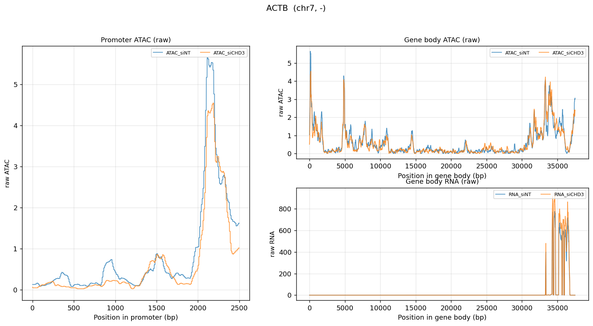
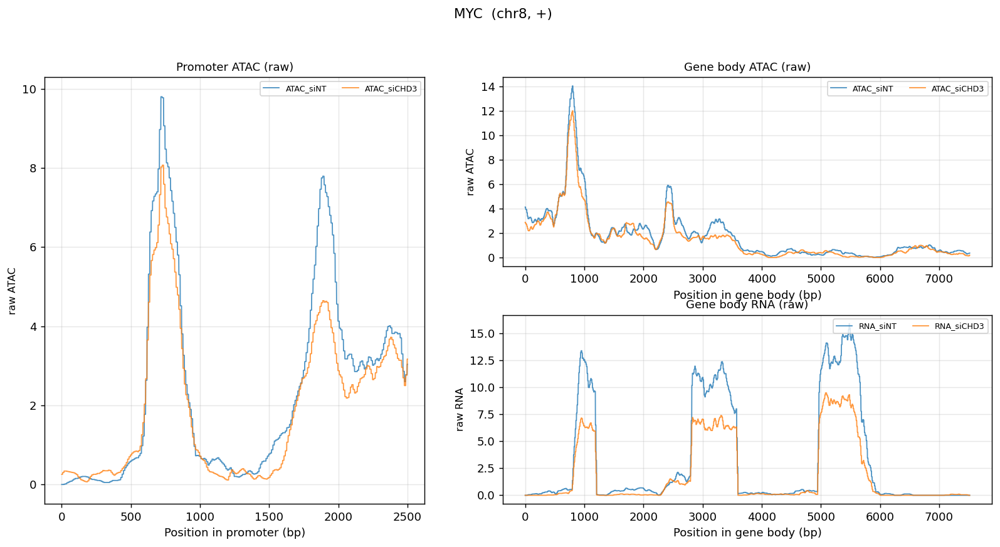
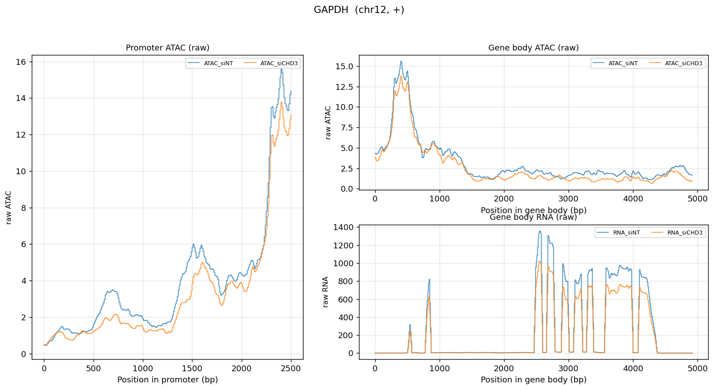
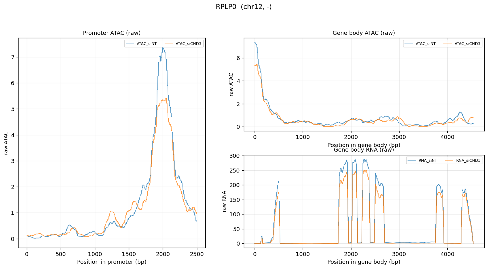
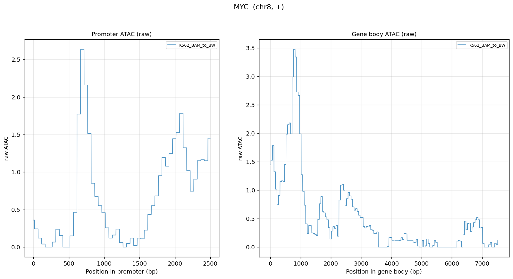

# PYTHON ATAC RNA-seq一站式读取

## 1.环境配置与.yaml导出

1. wsl中建立文件夹pATR并在vscode中打开

2. 添加通道

   ```bash
   conda config --add channels defaults
   conda config --add channels bioconda
   conda config --add channels conda-forge
   conda config --set channel_priority strict
   ```

3. 创建环境 ATAC_RNA_env

   ```bash
   conda create -n ATAC_RNA_env python=3.10 -y
   
   
   ```

4. 安装依赖库：pyBigwig用于读取bigwig文件，由于bigwig文件较大切实二进制，不自行编写库来完成

   GTF基因映射与Fasta文件读取：自行编写程序运行， gffutils、pysam 和 pyfaidx功能过多，且下载资源较多，不满足轻量化的要求

   ```bash
   conda install pandas numpy scipy matplotlib seaborn plotly dash jinja2 pybigwig pygenometracks ipykernel -y
   ```

5. 数据下载：

6. 解压缩：解压缩到data文件夹中，包含：

   1. Fasta文件 GRCh38.p14.genome.fa.gz
   2. GTF文件： GTF文件gencode.v49.basic.annotation.gtf.gz
   3. bigwigATAC文件：诱导多功能干细胞ATAC1 ENCFF234AYB.bigWig
   4. 诱导多功能干细胞ATAC2 ENCFF774QTX.bigWig
   5. 诱导多功能干细胞ATAC3 ENCFF435JGG.bigWig
   6. 诱导多功能干细胞ATAC4 ENCFF480VEI.bigWig
   7. RNASEQ:诱导多功能干细胞RNA-seq1 ENCFF684NXV.bigWig
   8. 诱导多功能干细胞RNA-seq2 ENCFF221VAA.bigWig
   9. 诱导多功能干细胞RNA-seq3 ENCFF602RUD.bigWig


## 2.文件读取

### 1.GTFs读取

由于不希望引入过多数据库，这部分读取自行编写

GTF文件记录了基因名称、位置、正链负链、转录本、外显子和CDS等信息

GTF是九列元素分开的可以直接读取并保存为pandas dataframe

其中第九列是具体的信息，使用；分割单独编写函数读取

同时还额外增加单基因查询功能，输入基因的名称与编号返回对应的GTFs信息，当然可以输入的是列表

```python
def parse_gtf_attributes(attribute_string):
    """
    解析 GTF 第 9 列 attributes。
    """
    attributes = {}

    fields = attribute_string.strip().split(";")

    for field in fields:
        field = field.strip()

        if field == "":
            continue

        if " " not in field:
            continue

        key, value = field.split(" ", 1)
        value = value.strip().strip('"')

        attributes[key] = value

    return attributes


def read_gtf_as_dataframe(gtf_file, promoter_upstream=200, promoter_downstream=200):
    """
    读取 GTF 文件中的 gene 行，并保存为 pandas.DataFrame。

    参数
    ----
    gtf_file : str
        GTF 文件路径。

    promoter_upstream : int
        TSS 上游长度，默认 200 bp。

    promoter_downstream : int
        TSS 下游长度，默认 200 bp。

    返回
    ----
    genes_df : pandas.DataFrame
        每一行是一个基因，包含基因坐标和 promoter 坐标。
        注意GTF每一个的间隔是用\t分隔的

    坐标说明
    ----
    GTF 原始坐标是 1-based inclusive。
    本函数会转换成 0-based half-open，方便后面用于 pyBigWig 和 FASTA。
    """
    records = []

    with open(gtf_file, "rt", encoding="utf-8") as gtf:
        for line in gtf:
            line = line.strip()

            if line == "":
                continue

            if line.startswith("#"):
                continue

            cols = line.split("\t")

            if len(cols) != 9:
                continue

            chrom = cols[0]
            source = cols[1]
            feature = cols[2]
            start_gtf = int(cols[3])
            end_gtf = int(cols[4])
            score = cols[5]
            strand = cols[6]
            frame = cols[7]
            attribute_string = cols[8]

            # 只读取 gene 行
            if feature != "gene":
                continue

            # 只保留 chr 开头的染色体
            # 包括 chr1, chr2, ..., chrX, chrY, chrM
            if not chrom.startswith("chr"):
                continue

            attr = parse_gtf_attributes(attribute_string)

            gene_id = attr.get("gene_id")
            gene_name = attr.get("gene_name", gene_id)
            gene_type = attr.get("gene_type", attr.get("gene_biotype"))

            if gene_id is None:
                continue

            gene_id_base = gene_id.split(".")[0]

            # GTF: 1-based inclusive
            # Python/BigWig/BED: 0-based half-open
            start = start_gtf - 1
            end = end_gtf

            length = end - start

            records.append({
                "gene_id": gene_id,
                "gene_id_base": gene_id_base,
                "gene_name": gene_name,
                "gene_type": gene_type,

                "chrom": chrom,
                "start": start,
                "end": end,
                "strand": strand,
                "length": length,

                "source": source,
                "score": score,
                "frame": frame,

                # 保留原始 GTF 坐标，方便检查
                "start_gtf": start_gtf,
                "end_gtf": end_gtf,

                # 保留原始 attribute 字符串，方便之后排查
                "attributes": attribute_string
            })

    genes_df = pd.DataFrame(records)

    if genes_df.empty:
        return genes_df

    genes_df = add_promoter_coordinates(
        genes_df,
        upstream=promoter_upstream,
        downstream=promoter_downstream
    )

    return genes_df


def add_promoter_coordinates(genes_df, upstream=200, downstream=200):
    """
    根据基因坐标计算 promoter 区域。

    默认：
    promoter = TSS 上游 200 bp + 下游 200 bp

    对于正链：
        TSS = start
        promoter_start = TSS - upstream
        promoter_end   = TSS + downstream

    对于负链：
        TSS = end
        promoter_start = TSS - downstream
        promoter_end   = TSS + upstream
    """
    df = genes_df.copy()

    df["tss"] = pd.NA
    df["promoter_start"] = pd.NA
    df["promoter_end"] = pd.NA

    plus_mask = df["strand"] == "+"
    minus_mask = df["strand"] == "-"

    # 正链：TSS 是 gene start
    df.loc[plus_mask, "tss"] = df.loc[plus_mask, "start"]
    df.loc[plus_mask, "promoter_start"] = df.loc[plus_mask, "tss"] - upstream
    df.loc[plus_mask, "promoter_end"] = df.loc[plus_mask, "tss"] + downstream

    # 负链：TSS 是 gene end
    df.loc[minus_mask, "tss"] = df.loc[minus_mask, "end"]
    df.loc[minus_mask, "promoter_start"] = df.loc[minus_mask, "tss"] - downstream
    df.loc[minus_mask, "promoter_end"] = df.loc[minus_mask, "tss"] + upstream

    # 如果 strand 既不是 + 也不是 -，暂时按正链处理
    other_mask = ~(plus_mask | minus_mask)
    df.loc[other_mask, "tss"] = df.loc[other_mask, "start"]
    df.loc[other_mask, "promoter_start"] = df.loc[other_mask, "tss"] - upstream
    df.loc[other_mask, "promoter_end"] = df.loc[other_mask, "tss"] + downstream

    # promoter_start 不能小于 0
    df["promoter_start"] = df["promoter_start"].clip(lower=0)

    # 转成整数
    df["tss"] = df["tss"].astype(int)
    df["promoter_start"] = df["promoter_start"].astype(int)
    df["promoter_end"] = df["promoter_end"].astype(int)

    return df
def parse_gtf_attributes(attribute_string):
    """
    解析 GTF 第 9 列的 attribute 字符串。

    例如输入:
        gene_id "ENSG00000223972.5"; gene_name "DDX11L1"; gene_type "lncRNA";

    返回:
        {
            "gene_id": "ENSG00000223972.5",
            "gene_name": "DDX11L1",
            "gene_type": "lncRNA"
        }
    """
    attr = {}

    # 匹配  key "value"  这种模式
    pattern = re.compile(r'(\S+)\s+"([^"]+)"')

    for match in pattern.finditer(attribute_string):
        key = match.group(1)
        value = match.group(2)
        attr[key] = value

    return attr


def query_genes_from_gtf(
    gtf_file,
    queries,
    feature_type="gene",
    promoter_upstream=200,
    promoter_downstream=200,
    return_dataframe=True,
    verbose=True
):
    """
    从 GTF 文件中按需批量查询基因信息。
    只遍历 GTF 文件一次，效率较高。

    参数
    ----
    gtf_file : str
        GTF 文件路径。

    queries : list[str] 或 str
        要查询的基因名字 (gene_name) 或基因编号 (gene_id) 列表。
        支持混合输入：
            - 基因名:        "DDX11L1"
            - 带版本号 ID:   "ENSG00000223972.5"
            - 不带版本号 ID: "ENSG00000223972"

    feature_type : str
        要查询的特征类型，默认 "gene"。

    promoter_upstream : int
        TSS 上游长度，默认 200 bp。

    promoter_downstream : int
        TSS 下游长度，默认 200 bp。

    return_dataframe : bool
        True  -> 返回 pandas.DataFrame
        False -> 返回 dict { query: info_dict }

    verbose : bool
        是否打印没找到的基因。

    返回
    ----
    results : pandas.DataFrame 或 dict
        每一行/每一项是一个基因的信息。
    """

    # ---- 1. 处理输入，统一成 list ----
    if isinstance(queries, str):
        queries = [queries]

    queries = [q.strip() for q in queries if q.strip() != ""]

    if len(queries) == 0:
        if return_dataframe:
            return pd.DataFrame()
        else:
            return {}

    # ---- 2. 把查询条件分成三个集合，方便比对 ----
    # 用 set 提升查询速度
    name_set = set()         # 基因名集合
    id_full_set = set()      # 带版本号 ID 集合
    id_base_set = set()      # 不带版本号 ID 集合

    # 同时记录每个 query 对应的原始字符串
    # 这样最后可以告诉用户哪些没找到
    query_to_original = {}

    for q in queries:
        if q.startswith("ENSG") or q.startswith("ENSMUSG"):
            # 当作 Ensembl ID
            id_full_set.add(q)
            id_base_set.add(q.split(".")[0])
            query_to_original[q] = q
        else:
            # 当作基因名字
            name_set.add(q)
            query_to_original[q] = q

    # ---- 3. 遍历 GTF 文件 ----
    found = {}   # key = 命中时用的查询字符串, value = info dict

    with open(gtf_file, "rt", encoding="utf-8") as gtf:
        for line in gtf:
            line = line.strip()

            if line == "" or line.startswith("#"):
                continue

            cols = line.split("\t")
            if len(cols) != 9:
                continue

            feature = cols[2]
            if feature != feature_type:
                continue

            attribute_string = cols[8]
            attr = parse_gtf_attributes(attribute_string)

            gene_id = attr.get("gene_id", "")
            gene_name = attr.get("gene_name", "")
            gene_id_base = gene_id.split(".")[0]

            # ---- 判断是否命中 ----
            matched_key = None

            if gene_name in name_set:
                matched_key = gene_name
            elif gene_id in id_full_set:
                matched_key = gene_id
            elif gene_id_base in id_base_set:
                matched_key = gene_id_base

            if matched_key is None:
                continue

            # ---- 解析坐标 ----
            chrom = cols[0]
            source = cols[1]
            start_gtf = int(cols[3])
            end_gtf = int(cols[4])
            score = cols[5]
            strand = cols[6]
            frame = cols[7]

            # GTF 1-based inclusive  ->  0-based half-open
            start = start_gtf - 1
            end = end_gtf
            length = end - start

            # ---- 计算 promoter ----
            if strand == "+":
                tss = start
                promoter_start = tss - promoter_upstream
                promoter_end = tss + promoter_downstream
            elif strand == "-":
                tss = end
                promoter_start = tss - promoter_downstream
                promoter_end = tss + promoter_upstream
            else:
                tss = None
                promoter_start = None
                promoter_end = None

            if promoter_start is not None and promoter_start < 0:
                promoter_start = 0

            info = {
                "query": matched_key,

                "gene_id": gene_id,
                "gene_id_base": gene_id_base,
                "gene_name": gene_name,
                "gene_type": attr.get("gene_type", attr.get("gene_biotype")),

                "chrom": chrom,
                "start": start,
                "end": end,
                "strand": strand,
                "length": length,

                "tss": tss,
                "promoter_start": promoter_start,
                "promoter_end": promoter_end,

                "source": source,
                "score": score,
                "frame": frame,

                "start_gtf": start_gtf,
                "end_gtf": end_gtf,

                "attributes": attribute_string
            }

            found[matched_key] = info

            # ---- 提前结束：所有都找到了 ----
            total_needed = len(name_set) + len(id_full_set) + len(id_base_set)
            # 注意 id_full 和 id_base 是同一组查询的两种形式，要避免重复计数
            # 简化判断：只看用户原始输入的数量
            if len(found) >= len(queries):
                break

    # ---- 4. 报告没找到的 ----
    if verbose:
        missing = []
        for q in queries:
            q_base = q.split(".")[0]
            # 命中的 key 可能是 gene_name / gene_id / gene_id_base
            if (q in found) or (q_base in found):
                continue
            missing.append(q)

        if missing:
            print(f"[warning] 以下基因没有找到 (共 {len(missing)} 个):")
            for m in missing:
                print(f"  - {m}")

    # ---- 5. 返回结果 ----
    if return_dataframe:
        if len(found) == 0:
            return pd.DataFrame()
        df = pd.DataFrame(list(found.values()))
        return df
    else:
        return found
```

最终效果：

### fasta读取与GTFs映射

fasta文件比较简单，>ch开头

利用正则表达式读取：

```python
def reverse_complement(seq):
    """
    计算 DNA 序列的反向互补序列，也就是负链序列。
    N不用替换
    最后在“”.join的方法反向输出
    """
    reseq=[]
    complement_table = {"A":"T","G":"C","T":"A","C":"G"}
    for i in seq:
        if i in complement_table:
            reseq.append(complement_table[i])
        else: 
            reseq.append(i)

    return "".join(reseq)[::-1]


def fasta_read(file):
    """
    读取一个 fasta 中的所有染色体的序列数据并分别储存。
    同时记录正链和负链。
    """

    sequences = {}
    midchr = None

    # 用正则匹配 > 开头的标题行
    # ^>      表示以 > 开头
    # (\S+)   表示一个或多个非空白字符，作为染色体名字
    st = re.compile(r"^>(\S+)")

    with open(file, "rt") as fasta:
        for line in fasta:
            line = line.strip()

            if line == "":
                continue

            # 用正则匹配是不是标题行
            match = re.match(st, line)

            if match:
                # 取出括号里捕获的内容，也就是染色体名字
                midchr = match.group(1)

                # 如果是新染色体就初始化
                if midchr not in sequences:
                    sequences[midchr] = []

                continue

            # 普通序列行，加到当前染色体里
            if midchr is not None:
                sequences[midchr].append(line)

    # 把每条染色体的多行序列拼起来，并生成正链和负链
    final = {}
    for chrom, seq_list in sequences.items():
        plus_seq = "".join(seq_list)
        minus_seq = reverse_complement(plus_seq)

        final[chrom] = {
            "+": plus_seq,
            "-": minus_seq
        }

    return final
```

### GTFs到fasta映射

接收一个由 `query_genes_from_gtf` 输出的基因信息字典，以及一个由 `fasta_read` 加载好的基因组字典，然后从基因组中切取出该基因相关的三段 DNA 序列：**启动子序列、基因本体序列、整段序列（上游 + 基因 + 下游）**。

**第一，正负链的自动方向处理。** 对于正链基因，TSS 在坐标较小的一端，上游就是 `start` 之前的区域；对于负链基因，TSS 在坐标较大的一端，上游变成了 `end` 之后的区域。函数会根据 `strand` 字段自动判断 TSS / TES 的位置，并正确计算上下游坐标。负链基因取出的序列会自动做**反向互补**，使得返回的序列是 mRNA 的 5’→3’ 方向，符合生物学习惯。

**第二，两套独立的扩展参数。** `promoter_upstream / promoter_downstream` 控制启动子区段的范围（一般几百 bp，用于找转录因子结合位点），`flank_upstream / flank_downstream` 控制整段序列两侧的延伸（一般几 kb，用于训练深度学习模型）。两套参数互不干扰，使用更灵活。

**第三，边界自动截断。** 当上下游超出染色体起点（小于 0）或终点（大于染色体长度）时，函数会自动把坐标裁剪到合法范围，不会报错。返回结果里同时包含**预期长度**和**实际长度**，方便用户检查是否发生了截断。

**第四，坐标系统一致。** 内部全程使用 0-based half-open 坐标，与 Python 切片直接兼容，避免了 GTF 1-based 闭区间带来的 off-by-one 错误。返回的坐标也是 0-based half-open，且**始终是正链坐标**（即基因组上的物理位置），不会因为负链而颠倒，方便后续映射回基因组。

**第五，丰富的返回信息。** 返回的字典除了三段序列本身，还包含基因的元数据（gene_id、gene_name、chrom、strand）、每一段的基因组坐标元组、每一段的预期长度与实际长度。用户既可以直接用序列，也可以追溯到基因组上的具体位置

```python
def get_gene_sequence(
    gene_info,
    fasta_dict,
    promoter_upstream=200,
    promoter_downstream=200,
    flank_upstream=2000,
    flank_downstream=2000,
    verbose=True
):
    """
    根据基因信息从基因组 FASTA 中切取相关序列。

    参数
    ----
    gene_info : dict
        由 query_genes_from_gtf 返回的单个基因的信息字典,
        必须包含: chrom, start, end, strand。
        推荐还有: gene_id, gene_name。

    fasta_dict : dict
        由 fasta_read 加载的基因组字典,
        结构为 { chrom: { "+": seq_str, "-": seq_str } }。
        本函数只使用 "+" 链 (正链), 负链通过反向互补获得。

    promoter_upstream : int
        启动子区段: TSS 上游 bp 数, 默认 200。

    promoter_downstream : int
        启动子区段: TSS 下游 bp 数, 默认 200。

    flank_upstream : int
        整段序列: TSS 上游 bp 数, 默认 2000。

    flank_downstream : int
        整段序列: TES 下游 bp 数, 默认 2000。

    verbose : bool
        是否打印边界截断警告。

    返回
    ----
    result : dict 或 None
        包含三段序列及其坐标信息的字典。
        如果染色体不在 fasta_dict 中, 返回 None。
    """

    # ---- 1. 读取基因信息 ----
    chrom = gene_info["chrom"]
    start = gene_info["start"]   # 0-based
    end = gene_info["end"]       # half-open
    strand = gene_info["strand"]

    gene_id = gene_info.get("gene_id", "")
    gene_name = gene_info.get("gene_name", "")

    # ---- 2. 检查染色体 ----
    if chrom not in fasta_dict:
        if verbose:
            print(f"[warning] 染色体 {chrom} 不在 fasta_dict 中, 跳过 {gene_name}")
        return None

    chrom_seq = fasta_dict[chrom]["+"]
    chrom_len = len(chrom_seq)

    # ---- 3. 根据 strand 计算各区段坐标 (基因组正链坐标) ----
    if strand == "+":
        # TSS 在 start, TES 在 end
        promoter_start = start - promoter_upstream
        promoter_end   = start + promoter_downstream

        full_start = start - flank_upstream
        full_end   = end + flank_downstream

    elif strand == "-":
        # TSS 在 end, TES 在 start
        promoter_start = end - promoter_downstream
        promoter_end   = end + promoter_upstream

        full_start = start - flank_downstream
        full_end   = end + flank_upstream

    else:
        if verbose:
            print(f"[warning] 未知 strand '{strand}', 跳过 {gene_name}")
        return None

    # gene_body 坐标不受 strand 影响
    gene_body_start = start
    gene_body_end = end

    # ---- 4. 记录预期长度 ----
    expected_promoter_len  = promoter_end - promoter_start
    expected_gene_body_len = gene_body_end - gene_body_start
    expected_full_len      = full_end - full_start

    # ---- 5. 边界裁剪到 [0, chrom_len) ----
    def clip(s, e):
        return max(0, s), min(chrom_len, e)

    promoter_start_c, promoter_end_c   = clip(promoter_start, promoter_end)
    gene_body_start_c, gene_body_end_c = clip(gene_body_start, gene_body_end)
    full_start_c, full_end_c           = clip(full_start, full_end)

    # ---- 6. 警告: 是否发生了截断 ----
    if verbose:
        if (promoter_start_c != promoter_start) or (promoter_end_c != promoter_end):
            print(f"[info] {gene_name} promoter 区段超出染色体边界, 已截断")
        if (full_start_c != full_start) or (full_end_c != full_end):
            print(f"[info] {gene_name} full 区段超出染色体边界, 已截断")

    # ---- 7. 切取正链序列 ----
    promoter_seq_plus  = chrom_seq[promoter_start_c : promoter_end_c]
    gene_body_seq_plus = chrom_seq[gene_body_start_c : gene_body_end_c]
    full_seq_plus      = chrom_seq[full_start_c : full_end_c]

    # ---- 8. 负链反向互补 ----
    if strand == "+":
        promoter_seq  = promoter_seq_plus
        gene_body_seq = gene_body_seq_plus
        full_seq      = full_seq_plus
    else:  # "-"
        promoter_seq  = reverse_complement(promoter_seq_plus)
        gene_body_seq = reverse_complement(gene_body_seq_plus)
        full_seq      = reverse_complement(full_seq_plus)

    # ---- 9. 组装结果 ----
    result = {
        "gene_id":   gene_id,
        "gene_name": gene_name,
        "chrom":     chrom,
        "strand":    strand,

        # 三段序列 (已按 strand 处理为 mRNA 方向)
        "promoter_seq":  promoter_seq,
        "gene_body_seq": gene_body_seq,
        "full_seq":      full_seq,

        # 基因组坐标 (0-based half-open, 始终是正链坐标)
        "promoter_coord":  (chrom, promoter_start_c, promoter_end_c),
        "gene_body_coord": (chrom, gene_body_start_c, gene_body_end_c),
        "full_coord":      (chrom, full_start_c, full_end_c),

        # 实际长度 vs 预期长度
        "promoter_len":           len(promoter_seq),
        "promoter_expected_len":  expected_promoter_len,

        "gene_body_len":          len(gene_body_seq),
        "gene_body_expected_len": expected_gene_body_len,

        "full_len":          len(full_seq),
        "full_expected_len": expected_full_len,
    }

    return result
    
    
```

### 整合

目前代码重复较多把 GTF 读取的公共逻辑（打开文件、跳过注释、解析 9 列、解析 attributes、计算 promoter、构建 record dict）抽到父类 `GTFReader` 里，两个子类只负责各自不同的逻辑：

- `GTFFullReader` - 全量读取（继承父类，只需指定「接受所有 gene 行」）
- `GTFQueryReader` - 列表查询（继承父类，加入查询过滤逻辑 + 命中提前结束


### ATAC与RNA-seq

这个模块负责把 ATAC-seq 和 RNA-seq 的 BigWig 文件信号「映射到基因区段上」。沿用前面的 OOP 思路，定义 `BigWigReader` 父类封装通用逻辑（打开文件、读取区间、边界处理、NaN 填充），两个子类 `ATACReader` 和 `RNAReader` 各自指定要读哪些区段：**ATAC 读取 promoter 和 gene_body 区段，RNA 读取 gene_body 区段**。

**关键变化**：本版本不做任何统计，每个区段的输出是一个 numpy 数组，长度等于该区段的碱基数，数组的每个元素是该位置在 BigWig 文件中的原始信号值（NaN 已填充为 0）。这样后续可以自由地做统计、画图、训练模型。**负链基因的信号会自动反转，与序列方向保持一致**

```python
# ============================================================
# BigWig Reader (ATAC / RNA) —— 只保留原始信号, 不做统计
# ============================================================

class BigWigReader:
    """BigWig 读取父类，封装通用逻辑。返回每个碱基的原始信号。"""

    def __init__(self, bw_files, sample_names=None, label="signal"):
        """
        参数
        ----
        bw_files : str 或 list[str]
            一个或多个 BigWig 文件路径。

        sample_names : list[str] 或 None
            样本名称列表，长度需与 bw_files 一致。
            None 时自动用文件名 (不含扩展名) 命名。

        label : str
            信号类型标签，例如 "atac" / "rna"，用作输出列名前缀。
        """
        if isinstance(bw_files, str):
            bw_files = [bw_files]

        self.bw_files = bw_files
        self.label = label

        if sample_names is None:
            sample_names = [
                os.path.splitext(os.path.basename(f))[0] for f in bw_files
            ]
        if len(sample_names) != len(bw_files):
            raise ValueError("sample_names 长度必须与 bw_files 一致")
        self.sample_names = sample_names

        self._bw_handles = None

    def _open(self):
        if self._bw_handles is None:
            self._bw_handles = [pyBigWig.open(f) for f in self.bw_files]

    def close(self):
        if self._bw_handles is not None:
            for bw in self._bw_handles:
                bw.close()
            self._bw_handles = None

    def __enter__(self):
        self._open()
        return self

    def __exit__(self, exc_type, exc_val, exc_tb):
        self.close()

    def _fetch_one(self, bw, chrom, start, end):
        """
        从单个 BigWig 读取区间信号，返回长度等于 end-start 的 numpy 数组。
        如果区间不合法或染色体不存在，返回全 0 数组。
        """
        expected_len = max(0, end - start)
        if expected_len == 0:
            return np.zeros(0, dtype=np.float32)

        if chrom not in bw.chroms():
            return np.zeros(expected_len, dtype=np.float32)

        chrom_len = bw.chroms()[chrom]
        start_c = max(0, start)
        end_c = min(chrom_len, end)

        # 初始化全 0 数组, 边界外位置保持 0
        out = np.zeros(expected_len, dtype=np.float32)

        if start_c >= end_c:
            return out

        values = bw.values(chrom, start_c, end_c, numpy=True)
        values = np.nan_to_num(values, nan=0.0)

        # 把读到的信号放到对应位置 (考虑边界截断)
        offset = start_c - start
        out[offset:offset + len(values)] = values
        return out

    def fetch_region(self, chrom, start, end, strand="+", region_name="region"):
        """
        从所有 BigWig 文件读取同一区段。

        参数
        ----
        chrom, start, end : 基因组正链坐标 (0-based half-open)
        strand : '+' 或 '-'，负链会把信号反转使其与 mRNA 方向一致
        region_name : 区段名，用于命名输出列

        返回
        ----
        dict, 形如:
        {
            "{label}_{sample}_{region_name}_signal": np.ndarray (1D, 长度 = end-start)
        }
        """
        self._open()
        result = {}
        for bw, name in zip(self._bw_handles, self.sample_names):
            values = self._fetch_one(bw, chrom, start, end)
            if strand == "-":
                values = values[::-1]  # 与序列方向一致
            key = f"{self.label}_{name}_{region_name}_signal"
            result[key] = values
        return result

    def fetch_gene(self, gene_info):
        """子类需重写。默认只读 gene_body。"""
        return self.fetch_region(
            chrom=gene_info["chrom"],
            start=gene_info["start"],
            end=gene_info["end"],
            strand=gene_info.get("strand", "+"),
            region_name="gene_body",
        )


class ATACReader(BigWigReader):
    """ATAC-seq BigWig 读取器，读取 promoter 和 gene_body 区段。"""

    def __init__(self, bw_files, sample_names=None):
        super().__init__(bw_files, sample_names=sample_names, label="atac")

    def fetch_gene(self, gene_info):
        chrom = gene_info["chrom"]
        strand = gene_info.get("strand", "+")
        result = {}

        if "promoter_start" in gene_info and "promoter_end" in gene_info:
            result.update(self.fetch_region(
                chrom=chrom,
                start=int(gene_info["promoter_start"]),
                end=int(gene_info["promoter_end"]),
                strand=strand,
                region_name="promoter",
            ))

        result.update(self.fetch_region(
            chrom=chrom,
            start=int(gene_info["start"]),
            end=int(gene_info["end"]),
            strand=strand,
            region_name="gene_body",
        ))
        return result


class RNAReader(BigWigReader):
    """RNA-seq BigWig 读取器，读取 gene_body 区段。"""

    def __init__(self, bw_files, sample_names=None):
        super().__init__(bw_files, sample_names=sample_names, label="rna")

    def fetch_gene(self, gene_info):
        return self.fetch_region(
            chrom=gene_info["chrom"],
            start=int(gene_info["start"]),
            end=int(gene_info["end"]),
            strand=gene_info.get("strand", "+"),
            region_name="gene_body",
        )


# ============================================================
# 总整合函数: 基因 -> 序列 + ATAC + RNA (信号数组)
# ============================================================

def assemble_gene_features(
    genes,
    fasta_dict,
    atac_reader=None,
    rna_reader=None,
    promoter_upstream=200,
    promoter_downstream=200,
    flank_upstream=2000,
    flank_downstream=2000,
    verbose=True,
    save_pickle=None,
):
    """
    把 GTF / FASTA / ATAC / RNA 全部整合，输出每个基因的完整特征。
    ATAC 和 RNA 的输出是每个碱基位置的原始信号数组 (numpy)。

    参数
    ----
    genes : pandas.DataFrame 或 str 或 list[dict]
        基因信息表 (来自 GTFFullReader / GTFQueryReader 或 CSV)。

    fasta_dict : dict
        由 fasta_read 加载的基因组字典。

    atac_reader : ATACReader 或 None
        ATAC-seq 读取器，None 表示跳过。

    rna_reader : RNAReader 或 None
        RNA-seq 读取器，None 表示跳过。

    promoter_upstream / promoter_downstream / flank_upstream / flank_downstream : int
        传给 get_gene_sequence 的参数。

    verbose : bool
        是否打印警告信息。

    save_pickle : str 或 None
        如果给定，保存结果为 pickle 文件 (CSV 无法直接存 numpy 数组)。

    返回
    ----
    pandas.DataFrame
        每一行一个基因，包含：
        - 基因元信息 (gene_id, gene_name, chrom, strand, ...)
        - promoter / gene_body / full 三段坐标
        - promoter / gene_body / full 三段 FASTA 序列
        - ATAC 各样本的 promoter / gene_body 信号数组
        - RNA  各样本的 gene_body 信号数组
    """

    # ---- 1. 统一输入 ----
    if isinstance(genes, str):
        if not os.path.exists(genes):
            raise FileNotFoundError(f"找不到文件: {genes}")
        gene_records = pd.read_csv(genes).to_dict(orient="records")
    elif isinstance(genes, pd.DataFrame):
        gene_records = genes.to_dict(orient="records")
    elif isinstance(genes, list):
        gene_records = genes
    else:
        raise TypeError(f"genes 参数类型不支持: {type(genes)}")

    if len(gene_records) == 0:
        if verbose:
            print("[warning] 输入基因列表为空")
        return pd.DataFrame()

    # ---- 2. 打开 BigWig ----
    if atac_reader is not None:
        atac_reader._open()
    if rna_reader is not None:
        rna_reader._open()

    # ---- 3. 逐基因整合 ----
    results = []
    success_count = 0
    fail_count = 0

    for gene_info in gene_records:
        seq_result = get_gene_sequence(
            gene_info,
            fasta_dict,
            promoter_upstream=promoter_upstream,
            promoter_downstream=promoter_downstream,
            flank_upstream=flank_upstream,
            flank_downstream=flank_downstream,
            verbose=verbose,
        )
        if seq_result is None:
            fail_count += 1
            continue

        record = {
            "gene_id": gene_info.get("gene_id", ""),
            "gene_id_base": gene_info.get("gene_id_base", ""),
            "gene_name": gene_info.get("gene_name", ""),
            "gene_type": gene_info.get("gene_type", ""),
            "chrom": gene_info["chrom"],
            "strand": gene_info["strand"],
            "start": gene_info["start"],
            "end": gene_info["end"],
            "length": gene_info.get("length", gene_info["end"] - gene_info["start"]),
            "tss": gene_info.get("tss"),
            "promoter_start": gene_info.get("promoter_start"),
            "promoter_end": gene_info.get("promoter_end"),
        }

        record["promoter_seq"] = seq_result["promoter_seq"]
        record["gene_body_seq"] = seq_result["gene_body_seq"]
        record["full_seq"] = seq_result["full_seq"]

        record["promoter_coord"] = seq_result["promoter_coord"]
        record["gene_body_coord"] = seq_result["gene_body_coord"]
        record["full_coord"] = seq_result["full_coord"]

        record["promoter_len"] = seq_result["promoter_len"]
        record["gene_body_len"] = seq_result["gene_body_len"]
        record["full_len"] = seq_result["full_len"]

        if atac_reader is not None:
            record.update(atac_reader.fetch_gene(gene_info))

        if rna_reader is not None:
            record.update(rna_reader.fetch_gene(gene_info))

        results.append(record)
        success_count += 1

    # ---- 4. 关闭 BigWig ----
    if atac_reader is not None:
        atac_reader.close()
    if rna_reader is not None:
        rna_reader.close()

    if verbose:
        print(f"[info] 特征整合完成: 成功 {success_count} 个, 失败 {fail_count} 个")

    df_out = pd.DataFrame(results) if results else pd.DataFrame()

    if save_pickle is not None and not df_out.empty:
        df_out.to_pickle(save_pickle)
        if verbose:
            print(f"[info] 已保存到 {save_pickle}")

    return df_out

```


## 3.统计分析、包封装与最终调用

前面的读取部分最开始是以单个 `read.py` 为主。现在为了让它可以作为真正的 Python 包安装和下载，代码已经整理成 `ATACread` 包。实际上传到 GitHub 的核心代码不再是散落的几个脚本，而是在 `atacread/` 目录下：

```text
atacread/
    __init__.py
    read.py
    signal_utils.py
    multiomics.py
    bam_tools.py
    cli.py

pyproject.toml
README.md
```

其中 `pyproject.toml` 负责告诉 Python 这个项目如何安装，`README.md` 负责 GitHub 首页说明，`atacread/` 里面才是真正被安装和调用的包代码。

当前包安装后提供两个命令名：

```bash
atacread --help
atacrna --help
```

`atacrna` 是保留的旧名字，方便前面测试时的习惯；新的正式名字是 `atacread`。

### 1.整体架构

我现在把整个工具包分成五层，不再把所有东西都堆在读取文件里。

```text
read.py
    负责 GTF / FASTA / BigWig 读取。
    只负责把基因、序列、ATAC 信号、RNA 信号取出来，不在这里做统计判断。

signal_utils.py
    负责信号统计、分箱置换检验、异常值检测、基因图绘制。
    这一层不直接关心文件来自哪里，只处理 numpy 数组。

multiomics.py
    负责把读取层和统计层串起来。
    主要提供 catalog / profile / paired 三个模式。

bam_tools.py
    负责可选的 BAM 下游部分，包括 BAM 质控、fragment length、count matrix、BAM 转 bigWig。
    这部分不是 bigWig 主流程必须的，但以后如果要从 BAM 开始做可以接上。

cli.py
    负责命令行入口。
    用户最后不需要自己写 Python 调函数，直接用 atacread catalog / profile / paired 即可。
```

这样拆开之后，读取、统计、整合、命令行调用是分开的。后面如果要改图，只动 `signal_utils.py`；如果要改全基因输出格式，只动 `multiomics.py`；如果要改命令行参数，只动 `cli.py`。

### 2.read.py：读取层

`read.py` 仍然是这个项目最底层的部分，前面已经详细写过 GTF 和 FASTA 的读取，这里主要补充现在包里的最终结构。

GTF 读取分成两种：

```python
GTFFullReader(gtf_file).read()
```

用于读取 GTF 中所有 gene 行，适合功能一的全基因输出。

```python
GTFQueryReader(gtf_file).query(items)
```

用于按基因名、gene_id 或者基因序号查找，适合只分析一个或几个基因。

FASTA 读取保留了自己写的轻量逻辑，没有直接依赖 `pyfaidx`。现在为了避免每次都读完整基因组，`fasta_read()` 加了目标染色体和缓存：

```python
fasta_dict = fasta_read(fasta_file, keep_chroms=target_chroms)
```

也就是说，如果只分析 `GAPDH`，它只需要读 `chr12`；如果分析多个基因，就只读这些基因所在的染色体。

BigWig 读取现在是父类和子类关系：

```python
class BigWigReader:
    """BigWig 读取父类，封装通用逻辑。返回每个碱基的原始信号。"""
```

这个父类负责：

- 打开一个或多个 bigWig 文件；
- 读取指定染色体区间；
- 把 NaN 填成 0；
- 对负链基因自动反转信号方向，使图上的方向和基因 5' 到 3' 一致；
- 兼容 `chr12` 和 `12` 这种染色体命名差异。

这里有一个后面排错时很重要的函数：

```python
@staticmethod
def _resolve_chrom_name(chroms, chrom):
    """兼容 GTF/FASTA 和 bigWig 之间 chr 前缀不一致的情况。"""
    if chrom in chroms:
        return chrom
    chrom = str(chrom)
    if chrom.startswith("chr"):
        alt = chrom[3:]
        if alt in chroms:
            return alt
    else:
        alt = "chr" + chrom
        if alt in chroms:
            return alt
    return None
```

这个问题在 GSE323137 数据里实际遇到了：GTF 是 `chr12`，但部分 RNA bigWig 里面是 `12`。如果不处理，RNA 会被读成全 0。现在这个函数会自动转换。

ATAC 和 RNA 的子类只负责声明自己读哪些区域：

```python
class ATACReader(BigWigReader):
    """ATAC-seq BigWig 读取器，读取 promoter 和 gene_body 区段。"""

    def __init__(self, bw_files, sample_names=None):
        super().__init__(
            bw_files,
            sample_names=sample_names,
            label="atac",
            regions=("promoter", "gene_body"),
        )
```

```python
class RNAReader(BigWigReader):
    """RNA-seq BigWig 读取器，读取 gene_body 区段。"""

    def __init__(self, bw_files, sample_names=None):
        super().__init__(
            bw_files,
            sample_names=sample_names,
            label="rna",
            regions=("gene_body",),
        )
```

因此现在的逻辑是：

- ATAC：读 promoter + gene_body；
- RNA：读 gene_body；
- 读取结果都是每个碱基对应一个 signal 数值的 numpy 数组；
- 统计和绘图不在 `read.py` 里做。

最后由 `assemble_gene_features()` 统一整合：

```python
def assemble_gene_features(
    genes,
    fasta_dict,
    atac_reader=None,
    rna_reader=None,
    promoter_upstream=200,
    promoter_downstream=200,
    flank_upstream=2000,
    flank_downstream=2000,
    verbose=True,
    save_pickle=None,
    include_gene_body_seq=False,
    include_full_seq=False,
):
```

这个函数的输出是一张 `DataFrame`，每一行是一个基因，里面有基因坐标、promoter 坐标、promoter 序列、ATAC 信号数组和 RNA 信号数组。后面所有统计都基于这张表。

### 3.signal_utils.py：统计与绘图层

`signal_utils.py` 是现在的统计模块。这里有一个重要变化：目前正式流程不再做中位数比例法强行归一化，也不再做基线平移对齐。原因是前面测试时发现，如果样本之间本来存在真实高低差，过强的矫正会把真实差异也拉掉。

所以现在保留的原则是：

> 图和统计都基于 raw signal。统计结果回答的是“这两个文件在这个基因区域的观察信号是否不同”，不再试图区分这个差异来自批次、酶活性还是真实生物学变化。

最基础的统计函数是：

```python
def summarize(signal):
    arr = to_array(signal)
    if len(arr) == 0:
        return dict.fromkeys(["n_bp", "mean", "median", "peak", "peak_pos", "auc"], np.nan)
    return {
        "n_bp": int(len(arr)),
        "mean": float(np.mean(arr)),
        "median": float(np.median(arr)),
        "peak": float(np.max(arr)),
        "peak_pos": int(np.argmax(arr)),
        "auc": float(np.sum(arr)),
    }
```

这里的 `auc` 不是严格数学积分，而是这个区域所有碱基信号的总和，可以理解为这个区域的总可及性或总表达强度。

#### 分箱置换检验

直接把每个碱基当成一个独立观察值是不合适的，因为 bigWig 上相邻碱基的信号高度相关。现在采用的是“分箱后置换检验”：

1. 先把连续碱基信号切成若干 bin；
2. 每个 bin 取平均值；
3. 比较两条曲线的 bin 均值差；
4. 随机打乱标签，得到一个经验 p 值。

对应函数为：

```python
def binned_permutation_test(signal_a, signal_b, bin_size="auto",
                            n_permutations=200, agg="mean",
                            random_state=0, region_name=None):
    """
    比较两条 raw accessibility 曲线的观察差异。

    统计单位是 bin，不是单个碱基；p 值来自标签随机置换。
    这个检验回答的是“观察信号是否不同”，不区分批次差异和生物学差异。
    """
```

这里默认 `n_permutations=200`，是为了控制计算量。置换次数越多，p 值越细，但运行也越慢。200 次时最小 p 值大约是：

```text
1 / (200 + 1) = 0.004975
```

#### 自动 bin size

bin 不能固定死用 20 bp。promoter 较短，可以细一点；gene body 可能很长，如果一直用 20 bp 会切出几百上千个点，统计会变得过于敏感。

所以现在加了自动分箱：

```python
def auto_bin_size(signal_length, region_name=None,
                  promoter_target_bins=120, genebody_target_bins=150,
                  min_bin_size=20, max_bin_size=150):
    """
    根据区域长度自动选择 bin 大小。

    promoter 保留更高分辨率；gene body 更长，目标是控制 bin 数量，
    避免长区域因为切出过多 bin 而使检验过于敏感。
    """
```

默认规则是：

- promoter：目标大约 120 个 bin；
- gene body / RNA gene body：目标大约 150 个 bin；
- 最小 bin size 为 20 bp；
- 最大 bin size 为 150 bp。

例如：

```text
2500 bp promoter -> bin size 约 21 bp
7080 bp gene body -> bin size 约 48 bp
```

输出表里会记录：

```text
bin_size
bin_size_mode
n_bins_a
n_bins_b
```

这样后面看结果时能知道实际用了多大的块。

#### 绘图

现在每个基因输出一张整合图，而不是以前上下很多张图：

```python
def plot_gene_signals(gene_name, atac_promoter_raw,
                      atac_genebody_raw,
                      rna_raw,
                      output_png, title_suffix="", promoter_seq=None,
                      promoter_seq_max_len=400):
```

图的布局是：

```text
左侧：promoter ATAC raw
右上：gene body ATAC raw
右下：gene body RNA raw
```

如果 promoter 长度不超过 400 bp，就在 promoter 图的横坐标上显示 FASTA 读取到的碱基序列。这样可以直接看某个可及性峰附近是不是有可能对应 motif。

这里刻意去掉了峰值文字标注。之前图上文字太多，尤其多个样本叠在一起时会遮住曲线。现在只保留曲线和图例，统计值放到 CSV 里。

### 4.multiomics.py：整合层

`multiomics.py` 是现在的 pipeline 主体。它把 `read.py` 取出的信号数组交给 `signal_utils.py` 做统计和绘图。

目前主要有三个模式。

#### catalog：全基因整合输出

```python
def run_catalog(gtf_file, fasta_file, atac_files=None, rna_files=None,
                output_dir="output_catalog",
                promoter_upstream=200, promoter_downstream=200,
                atac_names=None, rna_names=None,
                classify_state=True):
```

这个函数对应功能一。输入 GTF、FASTA、ATAC bigWig、RNA bigWig，输出全基因的统计表。

这里需要特别注意：`catalog` 是全 GTF 模式，可能一次处理七八万个基因，所以现在代码不会再像 `profile` 那样把所有基因的 per-base 信号数组都存进内存。它会按基因逐个读取 bigWig，读完马上计算 mean / median / peak / auc，只保留这些标量统计值。这样可以避免全基因输出时被系统 `Killed`。

主要输出：

```text
gene_catalog.csv
classification_thresholds.csv
```

其中 `gene_catalog.csv` 每一行代表一个基因，包含：

- `gene_id`
- `gene_name`
- `gene_type`
- `chrom`
- `strand`
- `start / end / length`
- `promoter_start / promoter_end`
- 每个 ATAC 样本的 promoter 统计值；
- 每个 ATAC 样本的 gene_body 统计值；
- 每个 RNA 样本的 gene_body 统计值。

这里的统计值来自 `summarize()`，包括：

```text
n_bp
mean
median
peak
peak_pos
auc
```

#### profile：单基因或多基因作图和比较

```python
def run_profile(gtf_file, fasta_file, atac_files=None, rna_files=None,
                genes=None, gene_file=None,
                output_dir="output_profile",
                promoter_upstream=200, promoter_downstream=200,
                atac_names=None, rna_names=None,
                outlier_z=2.5,
                bin_size="auto",
                n_permutations=200):
```

这个函数对应功能二。它适合分析一个或多个目标基因，比如 `GAPDH`、`ACTB`、`MYC`。

它会输出：

```text
基因名_signals.png
raw_permutation_tests.csv
outliers.csv
```

`raw_permutation_tests.csv` 里会分别比较：

```text
ATAC_promoter
ATAC_genebody
RNA_genebody
```

所以现在不是只比较 promoter，也会比较 gene body。

输出表中比较关键的列有：

- `sample_a / sample_b`：比较的两个样本；
- `region`：比较区域；
- `bin_size`：实际使用的分箱大小；
- `mean_a / mean_b`：分箱后的平均信号；
- `auc_a / auc_b`：区域总信号；
- `log2_auc_ratio`：总信号比例；
- `effect_size`：均值差相对于 pooled 标准差的大小；
- `p_value`：置换检验 p 值；
- `direction`：哪一个样本更高。

#### paired：配对方向判断

```python
def run_paired(gtf_file, fasta_file, atac_files, rna_files, metadata_file,
               genes=None, gene_file=None,
               output_dir="output_paired",
               promoter_upstream=200, promoter_downstream=200,
               atac_names=None, rna_names=None,
               lfc_threshold=0.5, make_pca=False,
               n_permutations=200):
```

这个模式是在 `profile` 的基础上，再读一个 metadata 文件，根据 `sample / assay / group` 去判断 ATAC promoter、ATAC gene body 和 RNA gene body 的变化方向是否一致。

metadata 至少需要：

```csv
sample,assay,group
ATAC_siNT,ATAC,control
ATAC_siCHD3,ATAC,treat
RNA_siNT,RNA,control
RNA_siCHD3,RNA,treat
```

主要输出：

```text
direction_analysis.csv
rna_expression_matrix.csv
```

这个模式目前更适合“处理组 vs 对照组”的小规模展示。如果后续要做正式差异分析，建议从 BAM 或 peak/count matrix 开始做，而不是只用 bigWig 曲线。

#### 兼容旧 demo 的接口

为了让前面写过的 `demo.py` 不完全失效，还保留了一个一站式接口：

```python
def extract_multiomics_features(gtf_file, fasta_file, atac_files=None, rna_files=None,
                                atac_sample_names=None, rna_sample_names=None,
                                genes=None, gene_file=None,
                                promoter_upstream=200, promoter_downstream=200,
                                output_dir="demo_multiomics_output",
                                save_per_base=False,
                                make_plots=True,
                                plot_first_n=10,
                                outlier_z=2.5,
                                bin_size="auto",
                                n_permutations=200):
```

这个函数本质上和 `profile` 很接近，只是输出格式兼容之前 demo 用过的字段。

### 5.bam_tools.py：可选 BAM 下游模块

这个模块不是目前 bigWig 主流程必须的，但它保留了从 BAM 开始继续做分析的接口。主要函数包括：

```python
bam_qc()
fragment_length_distribution()
plot_fragment_lengths()
frip_score()
tss_enrichment()
count_reads_in_regions()
count_matrix_from_bams()
bam_to_bigwig()
pydeseq2_differential()
run_bam_downstream()
```

这里的思路是：

```text
BAM -> QC / fragment length / FRiP / TSS enrichment
    -> BED 区域计数 -> count matrix -> PyDESeq2
    -> CPM bigWig -> 继续使用 profile / paired 作图
```

`bam_qc()` 除了 mapped、duplicate、MAPQ、proper pair 和线粒体比例，还输出非重复 primary read 比例和非重复片段单位比例。后者是一个简单的文库复杂度代理指标，不等同于 preseq 对文库复杂度的外推。

`frip_score()` 计算通过 MAPQ、primary 和 duplicate 过滤后的片段中，有多少至少与一个 BED peak 重叠。重叠 peak 不会让同一个片段在 FRiP 分子中重复计数。

`tss_enrichment()` 可以读取 BED6 或 GTF，按 ATAC 常用的正链 `+4 bp`、负链 `-5 bp` 插入位点修正，统计 TSS 两侧的聚合插入信号，并用窗口两端作为背景。输出汇总 CSV、逐位置 profile CSV 和曲线图。

区域计数和 bigWig 转换需要 coordinate-sorted BAM 与索引。新版本会检查索引；如果 BAM 已按坐标排序但缺少 `.bai`，默认使用 `pysam.index()` 自动创建。未排序 BAM 会明确报错，不再悄悄生成全零矩阵或全零 bigWig。

这部分更接近正式差异分析，因为标准的 ATAC 差异分析一般不是直接比较 bigWig 曲线，而是先得到 peak 或固定窗口区域上的 read count matrix，再进行统计建模。

但是本项目目前的主线仍然是：

```text
GTF + FASTA + ATAC bigWig + RNA bigWig -> gene-level 读取、作图、raw signal 检验
```

### 6.cli.py：命令行入口

安装包以后，最终用户主要通过命令行调用：

```bash
atacread catalog
atacread profile
atacread paired
atacread bam
atacread deseq2
```

在 `cli.py` 中，核心参数是：

```python
parser.add_argument("mode", choices=["catalog", "profile", "paired", "bam", "deseq2"])
parser.add_argument("--gtf", default=None, help="GTF annotation file.")
parser.add_argument("--fasta", default=None, help="Genome FASTA file.")
parser.add_argument("--atac", default=None, help="Comma-separated ATAC bigWig files.")
parser.add_argument("--rna", default=None, help="Comma-separated RNA bigWig files.")
parser.add_argument("--atac-names", default=None, help="Comma-separated ATAC sample names.")
parser.add_argument("--rna-names", default=None, help="Comma-separated RNA sample names.")
parser.add_argument("--bin-size", default="auto", help="Permutation-test bin size: auto or an integer.")
parser.add_argument("--regions", default=None, help="BED peaks/regions for count matrix and FRiP.")
parser.add_argument("--tss-regions", default=None, help="BED or GTF for TSS enrichment.")
parser.add_argument("--no-auto-index", action="store_true")
parser.add_argument("--keep-duplicates", action="store_true")
```

如果不手动传 `--gtf`、`--fasta`、`--atac`、`--rna`，程序会尝试在 `--work-dir` 里自动找文件。不过为了避免文件名混乱，正式运行时建议还是显式写清楚路径。

### 7.安装与下载

本项目已经上传到 GitHub：

```text
https://github.com/KDbio/ATACread
```

从 GitHub 安装：

```bash
pip install "ATACread[bigwig] @ git+https://github.com/KDbio/ATACread.git"
```

如果需要 BAM 和 PyDESeq2 的可选功能：

```bash
pip install "ATACread[all] @ git+https://github.com/KDbio/ATACread.git"
```

本地开发模式安装：

```bash
cd /mnt/d/学习内容/生物计算编程语言与linux/生物编程/teamwork
pip install -e ".[bigwig]"
```

如果只是你自己在当前环境里使用，开发模式更方便，因为改了代码后不用反复重新从 GitHub 下载。

### 8.功能一：全基因 ATAC 与 RNA 读取整合

这个功能使用 `catalog` 模式。

```bash
atacread catalog \
  -w "." \
  -o "output_catalog_all_genes" \
  --gtf "data/GTF文件gencode.v49.basic.annotation.gtf" \
  --fasta "data/FASTA文件 GRCh38.p14.genome.fa" \
  --atac "data/诱导多功能干细胞ATAC1 ENCFF234AYB.bigWig,data/诱导多功能干细胞ATAC2 ENCFF774QTX.bigWig,data/诱导多功能干细胞ATAC3 ENCFF435JGG.bigWig,data/诱导多功能干细胞ATAC4 ENCFF480VEI.bigWig,data/诱导多功能干细胞ATAC5 ENCFF581SQD.bigWig,data/诱导多功能干细胞ATAC6 ENCFF700MQI.bigWig" \
  --rna "data/诱导多功能干细胞RNA-seq1 ENCFF684NXV.bigWig,data/诱导多功能干细胞RNA-seq2 ENCFF221VAA.bigWig,data/诱导多功能干细胞RNA-seq3 ENCFF602RUD.bigWig" \
  --atac-names "ATAC1,ATAC2,ATAC3,ATAC4,ATAC5,ATAC6" \
  --rna-names "RNA1,RNA2,RNA3" \
  --promoter-upstream 2000 \
  --promoter-downstream 500
```

主要结果：

```text
output_catalog_all_genes/gene_catalog.csv
```

这个文件用于回答：

- 每个基因在 GTF 中的位置是什么；
- promoter 区间是什么；
- 每个 ATAC 文件在 promoter 和 gene body 上的 mean / median / peak / auc；
- 每个 RNA 文件在 gene body 上的 mean / median / peak / auc。

如果只想输出部分基因，目前可以用 `profile` 模式，或者在 Python 里调用 `run_catalog()` 前先传入筛选后的 gene 表。命令行的 `catalog` 当前主要面向全 GTF 输出。

### 9.功能二：单基因 ATAC/RNA 比较

这个功能使用 `profile` 模式。比如用 GSE323137 中 H23 Mock 的 siNT 和 siCHD3 比较 `GAPDH`：

```bash
atacread profile \
  -w "." \
  -o "output_GSE323137_GAPDH_H23_Mock_compare" \
  -g "GAPDH" \
  --gtf "data/GTF文件gencode.v49.basic.annotation.gtf" \
  --fasta "data/FASTA文件 GRCh38.p14.genome.fa" \
  --atac "data/GSE323137_aligned_bw/extracted/GSM9566628_ATAC_H23_Mock_siNT_96h.bw,data/GSE323137_aligned_bw/extracted/GSM9566627_ATAC_H23_Mock_siCHD3_96h.bw" \
  --rna "data/GSE323137_aligned_bw/extracted/GSM9562953_RNA_H23_Mock_siNT.bw,data/GSE323137_aligned_bw/extracted/GSM9562952_RNA_H23_Mock_siCHD3_96h.bw" \
  --atac-names "ATAC_siNT,ATAC_siCHD3" \
  --rna-names "RNA_siNT,RNA_siCHD3" \
  --promoter-upstream 2000 \
  --promoter-downstream 500 \
  --bin-size auto \
  --n-permutations 200
```

主要结果：

```text
output_GSE323137_GAPDH_H23_Mock_compare/GAPDH_signals.png
output_GSE323137_GAPDH_H23_Mock_compare/raw_permutation_tests.csv
output_GSE323137_GAPDH_H23_Mock_compare/outliers.csv
```

如果多个基因一起跑：

```bash
atacread profile \
  -w "." \
  -o "output_GSE323137_multi_gene_compare" \
  -g "GAPDH,ACTB,MYC,RPLP0" \
  --gtf "data/GTF文件gencode.v49.basic.annotation.gtf" \
  --fasta "data/FASTA文件 GRCh38.p14.genome.fa" \
  --atac "data/GSE323137_aligned_bw/extracted/GSM9566628_ATAC_H23_Mock_siNT_96h.bw,data/GSE323137_aligned_bw/extracted/GSM9566627_ATAC_H23_Mock_siCHD3_96h.bw" \
  --rna "data/GSE323137_aligned_bw/extracted/GSM9562953_RNA_H23_Mock_siNT.bw,data/GSE323137_aligned_bw/extracted/GSM9562952_RNA_H23_Mock_siCHD3_96h.bw" \
  --atac-names "ATAC_siNT,ATAC_siCHD3" \
  --rna-names "RNA_siNT,RNA_siCHD3" \
  --promoter-upstream 2000 \
  --promoter-downstream 500 \
  --bin-size auto \
  --n-permutations 200
```

也可以用基因列表文件：

```text
GAPDH
ACTB
MYC
RPLP0
```

运行：

```bash
atacread profile \
  -w "." \
  -o "output_gene_file_compare" \
  -f "genes.txt" \
  --gtf "data/GTF文件gencode.v49.basic.annotation.gtf" \
  --fasta "data/FASTA文件 GRCh38.p14.genome.fa" \
  --atac "ATAC1.bw,ATAC2.bw" \
  --rna "RNA1.bw,RNA2.bw" \
  --bin-size auto \
  --n-permutations 200
```

### 10.输出文件解读

`profile` 模式最重要的输出是 `raw_permutation_tests.csv`。

每一行表示两个样本在一个区域上的比较。区域包括：

```text
ATAC_promoter
ATAC_genebody
RNA_genebody
```

主要列含义：

```text
test
    当前为 binned_permutation。

bin_size / bin_size_mode
    实际使用的分箱大小，以及是 auto 还是 fixed。

n_bins_a / n_bins_b
    两个样本分别被切成多少个 bin。

mean_a / mean_b
    分箱后的平均信号。

auc_a / auc_b
    原始区域总信号。

auc_ratio / log2_auc_ratio
    两个样本总信号比例。

effect_size
    均值差相对于 pooled 标准差的大小。

p_value
    置换检验得到的经验 p 值。

direction
    higher_a / higher_b / flat。
```

需要注意的是，这个 p 值不是 DESeq2 那种基于 read count 模型的差异分析 p 值，而是对当前两个 bigWig 曲线在指定区域上的观察差异做经验检验。它适合用于本项目这种“按基因区域读取、画图、做初步比较”的场景。

### 11.目前工具包结构

最终项目结构如下：

```text
ATACread/
├── atacread/
│   ├── __init__.py
│   ├── read.py
│   ├── signal_utils.py
│   ├── multiomics.py
│   ├── bam_tools.py
│   └── cli.py
├── pyproject.toml
├── README.md
└── .gitignore
```

其中真正上传并作为 Python 包安装的是 `atacread/` 目录。根目录下以前的 `read.py`、`demo.py` 等文件可以作为开发过程中的草稿和历史版本保留，但正式安装时不会依赖它们。

这个结构的优点是：

1. 代码可以直接从 GitHub 下载并安装；
2. 命令行入口固定为 `atacread`；
3. 数据和输出文件不会被打包进 Python 包；
4. 读取、统计、整合、调用四个层次比较清楚；
5. 后续如果增加 peak/count matrix 路线，也可以继续放到 `bam_tools.py` 或新模块中。

### 12.实际运行案例

下面记录 2026 年 6 月 19 日实际运行得到的两组结果。第一组用于确认全 GTF 基因可以被逐个读取并写入目录表，第二组使用 GSE323137 的 H23 Mock 数据比较 siNT 与 siCHD3 96 h 条件。这里保留原始 bigWig 信号，不做基线对齐，也不把曲线强行缩放到相同水平。

#### 12.1 全基因 ATAC 与 RNA 整合

运行命令与前面“功能一”相同，输入为 gencode v49 GTF、GRCh38.p14 FASTA、6 个 ATAC bigWig 和 3 个 RNA bigWig。程序最终生成：

```text
output_catalog_all_genes/
├── gene_catalog.csv
└── classification_thresholds.csv
```

本次 `gene_catalog.csv` 的实际结果为：

| 项目 | 结果 |
|---|---:|
| 基因数 | 78,691 |
| 数据列数 | 102 |
| 文件大小 | 约 99.9 MB |
| active | 6,250 |
| intermediate | 70,171 |
| post_transcriptional | 2,270 |

102 列包含 GTF 坐标、启动子坐标，以及每个 ATAC 样本在 promoter 和 gene body 上的 `n_bp / mean / median / peak / peak_pos / auc`，每个 RNA 样本在 gene body 上也有同样的统计量。程序在 `catalog` 模式中逐基因读取并立即保存标量统计，不再把 78,691 个基因的全部逐碱基数组同时留在内存中，因此解决了此前运行到“提取 78691 个基因的特征”后被系统 `Killed` 的问题。

`classification_thresholds.csv` 保存本次数据集按全基因 25% 和 75% 分位数得到的经验阈值：

| 信号 | 低阈值（25%） | 高阈值（75%） |
|---|---:|---:|
| promoter ATAC | 0.1056 | 22.7541 |
| gene body ATAC | 0.1182 | 5.0480 |
| RNA gene body | 0 | 0.01682 |

例如，从目录表中抽取几个常用基因，并对 6 个 ATAC 或 3 个 RNA 样本的 `mean` 再取样本间平均，可得到：

| 基因 | promoter ATAC 平均值 | gene body ATAC 平均值 | RNA 平均值 | gene_state |
|---|---:|---:|---:|---|
| POU5F1 | 19.3013 | 16.8206 | 0.05306 | intermediate |
| SOX2 | 76.6063 | 5.0587 | 0.000160 | intermediate |
| NANOG | 21.0010 | 16.8313 | 0.000249 | intermediate |
| MYC | 20.4763 | 20.7132 | 1.33674 | intermediate |

这里的 `gene_state` 是根据本批数据的分位数阈值进行的描述性分类，不等于正式的差异表达结论。尤其 RNA bigWig 的量纲取决于原文件生成方式，不应直接拿这些阈值与另一个数据集比较。

#### 12.2 GSE323137 多基因原始信号比较

本次使用同一条命令同时读取 `ACTB、MYC、GAPDH、RPLP0`：

```bash
atacread profile \
  -w "." \
  -o "output_GSE323137_GAPDH_H23_Mock_compare" \
  -g "ACTB,MYC,GAPDH,RPLP0" \
  --gtf "data/GTF文件gencode.v49.basic.annotation.gtf" \
  --fasta "data/FASTA文件 GRCh38.p14.genome.fa" \
  --atac "data/GSE323137_aligned_bw/extracted/GSM9566628_ATAC_H23_Mock_siNT_96h.bw,data/GSE323137_aligned_bw/extracted/GSM9566627_ATAC_H23_Mock_siCHD3_96h.bw" \
  --rna "data/GSE323137_aligned_bw/extracted/GSM9562953_RNA_H23_Mock_siNT.bw,data/GSE323137_aligned_bw/extracted/GSM9562952_RNA_H23_Mock_siCHD3_96h.bw" \
  --atac-names "ATAC_siNT,ATAC_siCHD3" \
  --rna-names "RNA_siNT,RNA_siCHD3" \
  --promoter-upstream 2000 \
  --promoter-downstream 500 \
  --bin-size auto \
  --n-permutations 200
```

这两个 RNA bigWig 使用 `1、2、3...` 作为染色体名称，而 GTF 使用 `chr1、chr2、chr3...`。读取器会自动完成 `chr12 <-> 12` 这类名称转换，所以这次 RNA 曲线不再全部为 0。

每张图左侧是 2,500 bp promoter ATAC，右上是完整 gene body ATAC，右下是完整 gene body RNA。由于本次 promoter 长度大于 400 bp，程序按设定不显示逐碱基 FASTA 字母，避免横坐标挤成一团。

| ACTB | MYC |
|---|---|
|  |  |

| GAPDH | RPLP0 |
|---|---|
|  |  |

`raw_permutation_tests.csv` 共得到 12 行，即 4 个基因分别比较 promoter ATAC、gene body ATAC 和 gene body RNA。下表保留最适合直接解释的 `log2(AUC ratio)`、效应量和经验 p 值，其中 A 为 siNT，B 为 siCHD3：

| 基因 | 区域 | log2(AUC A/B) | effect size | p 值 | 方向 |
|---|---|---:|---:|---:|---|
| ACTB | ATAC promoter | 0.366 | 0.167 | 0.2090 | siNT 较高 |
| ACTB | ATAC gene body | 0.055 | 0.030 | 0.8209 | siNT 较高 |
| ACTB | RNA gene body | -0.268 | -0.044 | 0.6468 | siCHD3 较高 |
| MYC | ATAC promoter | 0.305 | 0.204 | 0.0995 | siNT 较高 |
| MYC | ATAC gene body | 0.262 | 0.146 | 0.2836 | siNT 较高 |
| MYC | RNA gene body | 0.723 | 0.307 | 0.00995 | siNT 较高 |
| GAPDH | ATAC promoter | 0.282 | 0.208 | 0.1095 | siNT 较高 |
| GAPDH | ATAC gene body | 0.286 | 0.204 | 0.0746 | siNT 较高 |
| GAPDH | RNA gene body | 0.355 | 0.152 | 0.1940 | siNT 较高 |
| RPLP0 | ATAC promoter | 0.151 | 0.077 | 0.5373 | siNT 较高 |
| RPLP0 | ATAC gene body | 0.247 | 0.110 | 0.3731 | siNT 较高 |
| RPLP0 | RNA gene body | 0.247 | 0.102 | 0.4527 | siNT 较高 |

从这次结果看，ATAC 的大多数比较方向为 siNT 较高，但效应量不大，200 次置换下没有一项达到 `p < 0.05`。RNA 中只有 MYC 在未做多重检验校正时达到 `p = 0.00995`，对应 AUC 约为 siCHD3 的 1.65 倍。其余结果只能描述为趋势，不能直接写成显著差异。

这里一共进行了 12 项检验，目前 CSV 中保存的是未经多重校正的经验 p 值。如果按 12 项做 Bonferroni 校正，阈值约为 `0.00417`；200 次置换能够得到的最小经验 p 值约为 `1 / 201 = 0.00498`，因此本案例不适合据此给出经过严格多重校正的显著性结论。它更适合作为曲线级初筛，正式差异分析仍应使用有生物学重复的 BAM/peak count matrix。

本次 `outliers.csv` 为空也不能解释为“已经证明没有异常样本”。当前异常检测至少需要 3 个同类样本，而这里每种组学只有 siNT 和 siCHD3 两条曲线，因此程序跳过了异常值判断。

### 13.BAM 质控、统计和 bigWig 转换

从 0.2.0 版本开始，BAM 模块不仅保留区域计数和 bigWig 转换，还补充了 FRiP、TSS enrichment、非重复片段比例、输入校验和自动索引。

安装完整依赖：

```bash
pip install -e ".[all]"
```

如果只想检查 BAM 和片段长度，不需要 BED：

```bash
atacread bam \
  --bam "sample1.bam,sample2.bam" \
  --sample-names "sample1,sample2" \
  --no-bigwig \
  -o "output_bam_qc"
```

完整运行 QC、fragment length、FRiP、TSS enrichment、count matrix 和 bigWig：

```bash
atacread bam \
  --bam "sample1.bam,sample2.bam" \
  --sample-names "sample1,sample2" \
  --regions "consensus_peaks.bed" \
  --tss-regions "genes_tss.bed" \
  --min-mapq 30 \
  --bigwig-bin-size 50 \
  -o "output_bam_full"
```

`--tss-regions` 也可以直接传 GTF，但全 GTF 会比精简后的 TSS BED 慢。默认排除 secondary、supplementary、低 MAPQ 和 duplicate reads；只有在明确需要时才添加 `--keep-duplicates`。

主要输出为：

```text
bam_qc_summary.csv
fragment_summary.csv
frip_summary.csv
tss_enrichment_summary.csv
sample1_fragment_lengths.csv
sample1_fragment_lengths.png
sample1_tss_profile.csv
sample1_tss_enrichment.png
count_matrix.csv
sample1.bin50.cpm.bw
```

`count_matrix.csv` 可继续交给纯 Python 的 PyDESeq2：

```bash
atacread deseq2 \
  --count-matrix "output_bam_full/count_matrix.csv" \
  --metadata "metadata.csv" \
  --condition-col "condition" \
  --reference-level "control:treat" \
  -o "output_deseq2"
```

metadata 至少包含：

```csv
sample,condition
sample1,control
sample2,treat
```

PyDESeq2 必须使用 BAM/peak 得到的非负整数 count matrix，不能把 bigWig 的连续信号直接当 count 输入。

#### 本地数据与测试情况

当前 `data/` 目录和 `GSE323137_RAW.tar` 的文件清单中没有 `.bam / .bai / .cram / .sam`，只有 bigWig、GTF、FASTA 和压缩包，因此暂时不能用已下载的真实数据验证 BAM 模块。

代码测试使用 `pysam` 生成了一个 coordinate-sorted 的合成双端 BAM，其中预先设置了 10 个 peak 内片段、5 个有效背景片段、重复片段和低 MAPQ 片段。测试确认：

1. 缺少索引时可以自动生成 `.bai`；
2. FRiP 正确得到 `10 / 15 = 0.6667`；
3. peak count matrix 正确得到 10；
4. TSS enrichment 大于 1，并输出 profile 和图片；
5. bigWig 在 peak 区域存在非零覆盖；
6. BAM 数量与 sample name 数量不一致时会报错；
7. 不提供 BED 时，命令行仍可以单独执行 BAM QC 和 fragment length。
8. PyDESeq2 0.5.2 可以直接读取 count matrix CSV；在 6 个合成样本、40 个 peak 的测试中，预设升高的前 8 个 peak 均得到正 log2 fold change 和显著的校正 p 值。

这个合成测试用于确认程序逻辑和文件链路，不代表真实样本的质量。真实 BAM 到位后仍应检查测序类型、单双端、参考基因组版本、染色体命名和 peak BED 是否匹配。

### 14.真实人类 BAM 到 bigWig 案例

为了验证 BAM 模块不是只对合成文件有效，选择了 ENCODE 的公开人类 K562 ATAC-seq 数据：

```text
实验：ENCSR859USB
样本：Homo sapiens K562
参考基因组：GRCh38
BAM：ENCFF557RSA
文件类型：filtered paired-end alignments
文件大小：690,935,841 bytes
MD5：6d329f0d2d677a6dc745f02c8bf7121c
配套 replicate-1 IDR peaks：ENCFF202HWV
```

公开页面：

```text
https://www.encodeproject.org/experiments/ENCSR859USB/
https://www.encodeproject.org/files/ENCFF557RSA/
https://www.encodeproject.org/files/ENCFF202HWV/
```

文件下载到：

```text
data/ENCODE_human_ATAC_K562/ENCFF557RSA.bam
data/ENCODE_human_ATAC_K562/ENCFF557RSA.bam.bai
data/ENCODE_human_ATAC_K562/ENCFF202HWV.bed
```

MD5 与 ENCODE 元数据完全一致。BAM 为 coordinate-sorted，包自动生成了 3.47 MB 的 `.bai` 索引。

#### 真实 BAM 质控结果

| 指标 | 结果 |
|---|---:|
| BAM records | 17,171,518 |
| mapped rate | 1.0000 |
| proper pair rate | 1.0000 |
| MAPQ >= 30 | 0.9696 |
| 有效片段数 | 8,318,496 |
| 片段长度中位数 | 133 bp |
| 小于 100 bp 的片段比例 | 0.4239 |
| 140-220 bp 单核小体片段比例 | 0.1855 |
| FRiP（31,420 个 replicate-1 peaks） | 0.2078 |
| TSS enrichment（gencode v49，78,691 TSS） | 13.5461 |

这个 BAM 已经过 ENCODE 过滤和去重复，所以 duplicate rate 和线粒体 reads 为 0。我们用 gencode v49 全部 gene 计算出的 TSS enrichment 为 13.55，而 ENCODE 页面记录约 22.19；二者使用的 TSS 集合、过滤方式和背景归一化并不完全相同，因此不应要求数值完全一致。

#### 使用 Python 把 BAM 转为 bigWig

```python
from pathlib import Path
from atacread import bam_to_bigwig

bam_to_bigwig(
    bam_file=Path("data/ENCODE_human_ATAC_K562/ENCFF557RSA.bam"),
    output_bw=Path("output_ENCODE_K562_BAM_QC/K562_ATAC_rep1.bin50.cpm.bw"),
    bin_size=50,
    min_mapq=30,
    normalize="CPM",
    count_fragments=True,
    keep_duplicates=False,
    auto_index=True,
)
```

生成结果：

```text
output_ENCODE_K562_BAM_QC/K562_ATAC_rep1.bin50.cpm.bw
文件大小：287,586,730 bytes
染色体/参考序列数：195
chr1 长度：248,956,422 bp
```

在配套 peak `chr22:21641857-21642551` 中检查得到：

```text
mean CPM coverage = 22.1239
max CPM coverage  = 36.1108
```

因此该文件不是空轨道，也不是全零轨道。随后将新生成的 bigWig 重新交给 `run_profile()`，读取 MYC 的 promoter 与 gene body：



这个案例也补充了两个接口修复：

1. `bam_to_bigwig()` 和 `BigWigReader` 均支持 `pathlib.Path`；
2. 只输入 ATAC、不输入 RNA 时，绘图自动使用两栏布局，不再保留空白 RNA 面板。
### 15.RNA 外显子区域与较宽松的变化判定

真核基因的基因本体中通常含有较长的内含子。对常规 RNA-seq bigWig 来说，直接把
整个基因本体取平均，会让大量没有成熟 RNA 覆盖的内含子把表达差异稀释掉。现在程序
读取 GTF 中同一基因的所有 `exon` 行，先合并不同转录本之间重叠的外显子，再按转录
方向拼接信号。这里没有只选 CDS，因为 5′/3′ UTR 和非编码 RNA 也属于实际转录区域。
没有外显子注释的自定义基因记录才回退到整个 gene body。

同一基因的两条曲线具有对应的基因组位置，因此曲线比较改为“分箱后配对符号翻转
检验”。默认使用 200 次随机翻转，并同时满足下面两个条件时标记为变化：

```text
p_value <= 0.10
abs(log2_auc_ratio) >= 0.25
```

这比原先按 `0.05` 和 `0.5` 理解变化更宽松。CSV 仍保留原始 `p_value`、
`log2_auc_ratio` 和 `effect_size`，同时增加 `significant` 与 `change_call`，因此用户
可以自己重新设定标准，而不是只能接受程序给出的二元结论。

```bash
atacread profile \
  --gtf annotation.gtf \
  --fasta genome.fa \
  --genes GAPDH \
  --atac "atac_control.bw,atac_treat.bw" \
  --rna "rna_control.bw,rna_treat.bw" \
  --significance-level 0.10 \
  --lfc-threshold 0.25 \
  --n-permutations 200 \
  -o output_GAPDH
```

需要注意：如果每组只有一个生物学样本，不能用“样本间检验”估计生物学重复的方差，
此时 `direction_analysis.csv` 的样本级 p 值会留空；仍可查看
`raw_permutation_tests.csv` 的同一区域曲线差异，但它表示观察到的信号曲线不同，不能
替代具有生物学重复的正式差异表达分析。

### 16.GTF 索引与多轨道整体偏离判断

原来的基因查询需要每次顺序遍历 GTF。对于 2.5 GB 左右的 GENCODE 注释，即使只查
一个基因，也可能因为基因位于靠后的染色体而等待很久。现在第一次执行包含 RNA 的
分析时，会在 GTF 旁边建立：

```text
annotation.gtf.atacread.sqlite
```

这个 SQLite 索引只依赖 Python 标准库，保存基因名称、Ensembl ID、GTF 顺序编号、
基因坐标和合并后的外显子区间。第一次仍需完整扫描一次 GTF，但之后按名称、ID 或编号
查询都直接访问索引。程序会比较原 GTF 的文件大小和修改时间，注释文件变化后自动
重建；启动子上下游长度是在读取索引后重新计算的，因此修改启动子参数不会重建索引。

也可以在正式分析前单独建立索引：

```bash
atacread gtf-index --gtf annotation.gtf
```

当同一区域有 3 条或更多轨道时，现在提供两层结果：

1. **偏离整体**：每条轨道与所有轨道逐位置中位数形成的总体曲线比较。中位数不会被
   少数极高或极低样本明显拉动，结果写入 `overall_deviation_tests.csv`；
2. **两两比较**：继续保留所有样本组合，结果写入 `raw_permutation_tests.csv`。

图片中每个 ATAC promoter、ATAC gene body 和 RNA exon 面板下方都会显示：

```text
Overall deviation  1 ATAC1: NO | 2 ATAC2: NO | 3 ATAC3: YES
Pairwise significance  1 ATAC1 vs ATAC2: NO | 2 ATAC1 vs ATAC3: YES | ...
```

如果有 `n` 条轨道，两两比较数目为 `n(n-1)/2`。编号和 CSV 中的 `sample_id`、
`comparison_id` 完全对应；项目仍保留连续的 p 值和变化倍数，图上的 YES/NO 只是按
当前 `--significance-level` 与 `--lfc-threshold` 得到的便捷标记。

### 17.FASTA 索引、指定转录本与 paired 数据复用

FASTA 现在使用标准五列 `.fai` 索引。第一次读取 `genome.fa` 时会生成
`genome.fa.fai`，之后根据索引中的字节偏移直接定位目标染色体，不再从头扫描整个
基因组。也可以提前建立：

```bash
atacread fasta-index --fasta genome.fa
```

如果 FASTA 的修改时间晚于 `.fai`，程序会自动重建。该实现使用 Python 文件定位，
不依赖 samtools 或其他 FASTA 库。

RNA 默认行为仍是不同转录本外显子的并集：

```bash
--rna-region-mode exon_union
```

如果研究问题针对某个剪接异构体，可以为每个目标基因指定一个 transcript ID：

```bash
atacread profile \
  -g "GENE1,GENE2" \
  --gtf annotation.gtf \
  --fasta genome.fa \
  --rna "rna1.bw,rna2.bw" \
  --rna-region-mode transcript \
  --transcripts "ENST000001,ENST000002"
```

转录本 ID 可以带版本号，也可以不带版本号。程序会在每个基因的 GTF 转录本表中匹配；
未找到，或者同一个基因匹配到多个用户指定转录本时，会直接报错，不会静默换成外显子
并集。

`paired` 模式过去先调用一次 `profile`，随后又重新读取 GTF、FASTA 和所有 bigWig。
现在先构建一次特征数据，绘图、曲线检验、表达矩阵和方向分析共享同一个 DataFrame。
命令行和输出文件不变，只减少重复 I/O 和内存分配；`paired` 同样支持上面的两个 RNA
区域参数。
